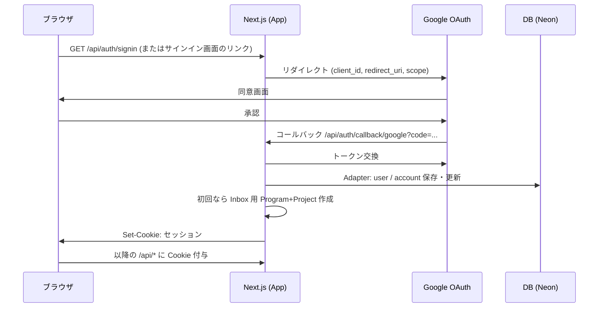

# アーキテクチャ（技術選定・データ・認証）

**位置づけ**  
[REQUIREMENTS.md](./REQUIREMENTS.md) の**非機能**と [IMPLEMENTATION-SPEC.md](./IMPLEMENTATION-SPEC.md) の**API**を実装可能な形に落とす。**改訂時は日付を追記**する。

**改訂**  
- 2026-04-24: 初版。技術選定、物理スキーマ、Auth、CORS/ Cookie、Neon+ Drizzle。

---

## 1. 技術選定（MVP 向け 確定案）

| 層 | 採用 | 備考 |
| --- | --- | --- |
| ホスティング | **Vercel** | 要件で確定。プレビュー、環境変数。 |
| フレームワーク | **Next.js**（**App Router**、実装時点の**安定 LTS/最新**のうち**保守に有利な方**） | サーバーと同一オリジンに API（Route Handlers）を置く。 |
| 言語 | **TypeScript**（strict 推奨） |  |
| スタイル | **Tailwind CSS** |  |
| UI 部品 | **shadcn/ui**（+ Radix 系） | [REQUIREMENTS.md](./REQUIREMENTS.md) §5 の**共通パーツ**方針に合致。 |
| 認証 | **Auth.js**（`next-auth` v5 系。パッケージ名は導入時点の**公式**に従う） | **Google プロバイダ**、セッションは後述。 |
| DB | **PostgreSQL**（**Neon** 推奨。サーバーレス接続＋Vercel 連携例が多い） | 接続: **@neondatabase/serverless** 等、またはドライバは Drizzle 推奨。 |
| ORM / SQL | **Drizzle ORM** + **drizzle-kit**（`migrate` / `push`） | スキーマを TS で管理、マイグレーションを Git 管理。Prisma への変更は**要議論**で可。 |
| E2E | **Playwright** | 範囲は [E2E-SCOPE.md](./E2E-SCOPE.md)。 |

**パッケージの実バージョン**は `package.json` が真実。本書の名称は**概念**として扱う。

**却下/保留**

- クライアントのみ BFF なし: OAuth 秘匿のため、**BFF 必須**で方針どおり。  
- Edge Runtime 専用 DB 以外: MVP は **Node** ランタイムで十分（Route Handler を優先）。Neon サーバーレスは併用可。

---

## 2. 物理データモデル（Postgres 案）

`user` は **Auth.js** の `Adapter` 用にテーブル名・列を合わせる。以下は**論理名**。実体は [Auth.js 公式の Postgres adapter スキーマ](https://authjs.dev) に合わせ、差分（例: `account.providerAccountId`）をマイグレーションで表現する。

### 2.1 アプリ固有テーブル（`public` 想定）

`programs`

| 列 | 型 | 制約 |
| --- | --- | --- |
| `id` | `uuid` | PK, default `gen_random_uuid()` |
| `user_id` | `uuid` | FK → `user.id`, ON DELETE CASCADE |
| `name` | `text` | NOT NULL |
| `start_on` | `date` | NULL 可（要件: NULL または広い期間） |
| `end_on` | `date` | NULL 可 |
| `created_at` | `timestamptz` | default `now()` |
| `updated_at` | `timestamptz` | default `now()` |

`projects`（`user_id` を持ち、**Inbox 一意**用）

| 列 | 型 | 制約 |
| --- | --- | --- |
| `id` | `uuid` | PK |
| `user_id` | `uuid` | FK → `user.id`, NOT NULL（全プロジェクト行でスコープ明確化） |
| `program_id` | `uuid` | FK → `programs.id`, ON DELETE CASCADE または RESTRICT（設計で選択） |
| `name` | `text` | NOT NULL |
| `is_inbox` | `boolean` | NOT NULL, default `false` |
| `created_at` / `updated_at` | `timestamptz` | 同上 |

- **部分一意索引**（1 ユーザー 1 Inbox プロジェクト）:  
  `CREATE UNIQUE INDEX projects_one_inbox_per_user ON projects (user_id) WHERE (is_inbox = true);`

`tasks`

| 列 | 型 | 制約 |
| --- | --- | --- |
| `id` | `uuid` | PK |
| `project_id` | `uuid` | FK → `projects.id` |
| `title` | `text` | NOT NULL |
| `status` | `text` または `task_status` ENUM | NOT NULL。値は [IMPLEMENTATION-SPEC.md §1](./IMPLEMENTATION-SPEC.md#1-タスクの状態列挙mvp-案と-gtd-対応) |
| `due_on` | `date` | NULL 可 |
| `note` | `text` | NULL 可 |
| `position` / `sort_order` | `int` または `double precision` | NULL 可。表示順。 |
| `created_at` / `updated_at` | `timestamptz` |  |

- `user_id` を `tasks` にも冗長化するか、**`projects` 経由**だけで RLS/検証するかは実装判断。MVP では **JOIN 必須**の API で十分なら**冗長なし**可。

`user_preferences`（テーマ永続化を DB にする場合）

| 列 | 型 | 制約 |
| --- | --- | --- |
| `user_id` | `uuid` | PK, FK → `user.id` |
| `theme` | `text` | 例: `light` / `dark` / `system`（将来） |

MVP は [REQUIREMENTS.md](./REQUIREMENTS.md) のとおり**localStorage のみ**でも可。その場合**本表はスキップ**。

### 2.2 マイグレーション

- **Drizzle**: `drizzle-kit generate` による SQL、CI で `migrate` 実行（または本番 Vercel のデプロイ hook）。  
- **初期データ**: なし。Inbox は **初回サインアップ**でアプリ層が投入（[IMPLEMENTATION-SPEC.md §4](./IMPLEMENTATION-SPEC.md#4-初回登録google-初回コールバック時のinbox-自動生成)）。

---

## 3. 認証フロー（Google OAuth + Auth.js）

### 3.1 シーケンス（ブラウザと同一オリジン前提）

### 3.2 初回 Inbox 生成の挿入位置

- **推奨**: `events` コールバック `createUser` 相当（Auth.js の**ユーザー作成直後**フック）で 1 トランザクション実行。重複は DB 制約＋`try/catch` で**冪等**に近づける。  
- 代替: 初回 `GET /api/me` 時に冪的作成（遅延）。**同時リクエスト**で二重化しやすいため、**DB 制約＋1 本のロック**推奨。

### 3.3 セッション方式

- **推奨（MVP）**: **JWT セッション**（`NEXTAUTH_SECRET` による署名 Cookie）。DB に `session` テーブルを**必須**にしなくてよい。  
- **DB セッション**: 取り消しが必要なら拡張。Neon 書き込み回数に注意。  

選んだ方式を **本節の「改訂」** に1行追記する。

### 3.4 必須環境変数（例）

- `AUTH_SECRET`（または `NEXTAUTH_SECRET`、採用ドキュメントに合わせる）  
- `AUTH_URL` / `NEXTAUTH_URL`（本番 URL）  
- `AUTH_GOOGLE_ID` / `AUTH_GOOGLE_SECRET`（Google Cloud Console の OAuth クライアント）  
- `DATABASE_URL`（Neon の接続文字列。`sslmode` 等含む）  

Vercel 上では**各環境**（Production / Preview / Development）に分ける。

---

## 4. CORS ・ Cookie ・ 同一オリジン

- **ブラウザ → Next.js** の HTML / RSC / Route Handler は**同一オリジン**（例: `https://app.example.com`）。**別ドメインの API**を呼ばない限り、**CORS 設定は原則不要**。  
- **クッキー**:  
  - `HttpOnly`, `Secure`（本番）, `Path=/`  
  - `SameSite=Lax`（従来の Google OAuth リダイレクトで一般的）  
- **Vercel Preview URL** ごとに Google Console の**承認リダイレクト URI**に追加する手間を避けたい場合: 本番＋`localhost` のみ、Preview は e2e 専用クライアント、など**運用で分割**可。

---

## 5. 今後追記する予定

- ディレクトリ構成（`app/` 配下のルーティング案）  
- エラーレスポンス形式（`{ error: { code, message } }` 等）  
- レート制限（Should 以降）  

以上。
