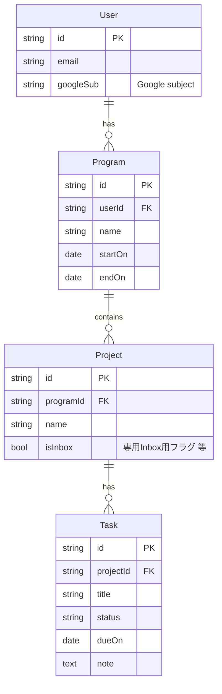

# 要件定義書（v0.3）

**対象アプリ**  
複数の期間付き活動（プログラム）の下でプロジェクトを束ね、タスクを GTD 的に扱う個人向けツール。最初は**無料**で**自分のみ**利用。最終的なクライアント形態は**まず Web**（将来 PWA や Tauri などのデスクトップ化はオプション）。

**ドキュメントの位置づけ**  
**ビジネス/プロダクト要件**の一次ソース。**タスク状態・API 詳細・物理スキーマ**は `docs/` の子文書に分割（[ドキュメント索引](#15-ドキュメント索引)）。

**改訂**  

- 2026-04-24: 初版（v0.1）
- 2026-04-24: v0.2 — カラースキーム切替・共通UIパーツ方針を追加。§13 を具体化。
- 2026-04-24: v0.3 — 実装寄りの章を [IMPLEMENTATION-SPEC.md](./IMPLEMENTATION-SPEC.md) 等へ移設。技術選定・DB・認証を [ARCHITECTURE.md](./ARCHITECTURE.md) に記録。§14 の次のステップを消化。
- 2026-04-24: §14 を MVP 第1弾完了と残タスク（運用・CI）の記述に更新。

---

## 1. プロダクトの核

| 項目       | 内容                                                                                     |
| -------- | -------------------------------------------------------------------------------------- |
| 想定利用者    | **個人**                                                                                 |
| 解く痛み     | プロジェクト横断で起きる **置き忘れ**、**優先度の迷子**、**〆切の可視化**の不足                                         |
| 差分の思想    | Notion のように「常に全編集」ではなく、**枠＋行動**で **FIX しやすい** タスク管理。Google 純正 ToDo の「管理ツールとしての未完成さ」を補う |
| 捨てられない体験 | **複数プロジェクト** ＋ **タスク** ＋ **GTD 的ダッシュボード**                                              |

**階層用語（確定）**

1. **プログラム** — 期間付きの「桶」
2. **プロジェクト** — プログラム内の作業の束
3. **タスク** — 実行単位

横断的な作業（展示会出展の「企画・リサーチ・共通アなど）は、専用の**横断プロジェクト**（例: 「出展｜企画・共通」）に置き、**他プロジェクトと並列**に管理する。タスクの「複数プロジェクト同時所属」は **MVP では導入しない**（1 タスクは 1 プロジェクトに属する）。

---

## 2. スコープ（MVP 案）

### 2.1 Must（第 1 弾）

- **Web** アプリ（クラウド同期、ログイン必須）
- **Google ログイン** のみ
- プログラム / プロジェクト / タスクの **CRUD**、タスクの **所属プロジェクトの変更**（Inbox から他プロジェクトへの移動を含む）
- **Inbox へ即投入**（会議中の即メモは **Inbox のみ** へ。プログラム/プロジェクトは指定しない）
- **GTD 寄りのダッシュボード**（受信封/Junk、今日・次、期限、プログラム/プロジェクトへの導線を含む。細部は実装段階で具体化）
- **週末向け：負荷ざっくりビュー**（[§6](#6-週末の負荷ざっくり仕様仮置き)）
- **カラースキームの切替**（少なくともライト/ダーク。切替可能。[§5](#5-表示とデザインui)）
- **共通UIパーツ**に基づく画面構成（[§5](#5-表示とデザインui)）

### 2.2 Should

- 週次レビュー導線（Inbox 整理・計画の見直し用の一覧/フィルタ）
- 即メモしたタスクの **一括整理** フロー（Inbox ゼロに近づける操作）

### 2.3 Could

- 工数/見積（タスクの所要時間）  
- ラベル・タグ、検索の強化  
- PWA / デスクトップラッパ（Tauri 等）

### 2.4 いったんやらない

- チーム同時編集、複雑なガント、Notion 型の完全自由文書

---

## 3. ユースケース（合意済み）

1. 朝: **今日〆**のタスクを確認し、**1 つ**を進行中にする
2. 会議中: **Inbox へ**迷わず即メモ（プログラム/プロジェクトは当てない）
3. 週末: **来週・来月**の負荷をざっくり把握する
4. 合間: 即メモを**整理**（プログラム/プロジェクトへ付ける、〆切を入れる等）
5. 定期: **計画の見直し・工程の組み換え**

---

## 4. エンティティと関係

### 4.1 概念

| エンティティ      | 説明                                                                                |
| ----------- | --------------------------------------------------------------------------------- |
| **User**    | Google アカウントに紐づく利用者。現状は 1 人利用想定だが、データはユーザー単位で分離。                                  |
| **Program** | 期間（開始/終了）を持つ桶。大きいイニシアチブ。                                                          |
| **Project** | Program に属する。Inbox 用・横断用のプロジェクトもここに含める。                                           |
| **Task**    | Project に 1 つ属する。Inbox 上のタスクは **専用 Inbox プロジェクト** 上のタスクとして表現（アプリ上は「Inbox」ビューで見せる） |

**Inbox の扱い（確定方針）**  

- 会議中の即メモは **Inbox プロジェクト** へ追加する。  
- 各ユーザーに **1 個の専用 Inbox プロジェクト**（システム管理フラグ可）を用意し、**「未整理の受信箱」用 Program**（名前は実装で固定またはユーザー変更可）配下に置く、などの定義にしてよい。  
- 整理時: タスクの **Project を差し替え**（別 Program の Project へ移動＝**プログラム越え**も可）。

**タスクの主な属性案（MVP）**

- タイトル、メモ（短文）、**状態**（`status` の列挙・GTD 対応は [IMPLEMENTATION-SPEC.md](./IMPLEMENTATION-SPEC.md#1-タスクの状態列挙mvp-案と-gtd-対応)）  
- **〆切**（日付。時刻の要否は段階的に可）  
- 作成/更新日時、表示順

### 4.2 ER 図（論理）

---

## 5. 表示とデザイン（UI）

本アプリの見た目は、**一貫性**と**改修容易性**のため、次を満たす。

### 5.1 カラースキーム

- ユーザーは**少なくとも 2 系統**（例: **ライト** / **ダーク**）のカラースキームを**切り替え**可能とする。  
- 選択は**永続**する。保存先の優先順位: **DB のユーザー設定**（ログイン跨ぎで同一）を第一。MVP では **localStorage 等のクライアントのみ**でも可（後から DB へ移行可能なキー名で実装する）。  
- 実装面では **CSS 変数**やフレームワークの**テーマ**機構で 1 か所定義に寄せ、画面ごとの色の直書きを避ける。  
- **システム設定（prefers-color-scheme）に追従する自動**を Could として検討可能。

### 5.2 共通パーツ（デザインシステム）

- **各画面の UI は、必ず「共通パーツ」**（共有コンポーネント＋定義されたトークン/バリアント）**を通じて**組み立てる。  
- **生の `button` や生の入力行**に、画面固有の class のみ足して毎回見た目を作る、といった**アドホックな重複**は**原則禁止**。不足が出たら**共通パーツを拡張**する。  
- 技術的には **専用の `components/ui/`（等）** に集約し、**ページ直下にその場限りの装飾コンポーネントを増やさない**方針とする。  
- 導入するUI基盤（shadcn/ui、MUI 等）は**技術選定**で固定し、**本要件は「行為規範」**として維持する。

---

## 6. 週末の「負荷ざっくり」仕様（仮置き）

MVP では**見積工数**は入れず、**件数**で扱い、心の負担を週単位で把握する。

- **期間**: **今日を含めた直後 2 週** ＋ **さらに先の 4 週**の計 **6 週**を「週のバケット」として扱う（週の開始: **週始めはロケールの週次設定に合わせる。初期は週=月曜始まり** など、実装で 1 つに固定）。  
- **指標**  
  - 各週: **〆切がその週に入る Task の件数**  
  - 週内は **〆切日が早いものから** 一覧でよい（ドラッグ並べは Could）
- **表示**  
  - 週ごとに**件数**を棒／バー状で可視化（週次ヒストグラム）＋ その週の **タスクリスト（折りたたみ可）**  
  - 〆切なしのタスクは**負荷週集計には含めない**（別枠件数表示は Should）

後続で **見積分** や **習慣的な〆切**を足すと精度が上がるが、MVP では**件数＋〆切週**で十分。

---

## 7. 画面一覧（MVP 中心）

| #   | 画面 / ルート   | 目的                                          |
| --- | ---------- | ------------------------------------------- |
| 1   | ログイン       | Google でサインイン                               |
| 2   | ダッシュボード    | GTD: Inbox 件数、今日/次、期限近いもの、各プログラムへショートカット    |
| 3   | Inbox      | 即メモの一覧。ここからタスクの編集、プロジェクトへの移動                |
| 4   | プログラム一覧    | 期間中の活動の俯瞰、新規作成                              |
| 5   | プログラム詳細    | 配下のプロジェクト一覧、期間表示                            |
| 6   | プロジェクト詳細   | タスクリスト（フィルタ: 全て/〆切/担当状態は実装で最小）              |
| 7   | タスク詳細 / 編集 | タイトル、メモ、〆切、ステータス、**所属プロジェクトの変更**            |
| 8   | 負荷ビュー（週次）  | [§6](#6-週末の負荷ざっくり仕様仮置き) の週 6 本＋件数＋展開        |
| 9   | 設定（最小）     | ログアウト、アカウント（Google）、**カラースキーム**、将来の拡張用のプレース |

---

## 8. 認証・マルチテナンシ

- **アカウント: Google ログイン のみ**（第 1 弾）  
- 全エンティティは **userId スコープ**（自分のデータのみ表示・更新）

---

## 9. 非機能（骨子）

| 分類      | 方針                                           |
| ------- | -------------------------------------------- |
| 可用性     | 個人利用。SLO 厳格化は行わない                            |
| セキュリティ  | HTTPS、認証必須、OWASP 常識的対策。秘密情報は env             |
| パフォーマンス | 1 人・数千タスク想定で UI が止まらない                       |
| バックアップ  | DB のバックアップは利用ホスティング/DB 側の機能に任せ、エクスポートは Could |

---

## 10. 技術スタック方針

- **Web**、**RDB**（Postgres）、同一オリジン上の **API** で OAuth と CRUD。  
- **パッケージ名・バージョン・物理スキーマ・認証**は [ARCHITECTURE.md](./ARCHITECTURE.md) が**真実**（v0.3 時点で Next.js + Drizzle + Neon + Auth.js + shadcn を採用案として記録）。

---

## 11. 用語集

| 用語           | 定義                                |
| ------------ | --------------------------------- |
| プログラム        | 期間付きの大きい桶                         |
| プロジェクト       | プログラム内の作業の束。Inbox・横断用もプロジェクトで表す   |
| タスク          | 1 行動。常に 1 プロジェクトに属する（MVP）         |
| GTD 的ダッシュボード | 受信・次・今日・文脈の切替を含むホーム的ビュー（細部は実装で定義） |

---

## 12. ホスティングの選定（Vercel と Cloudflare）

**結論: 本プロジェクト（個人向け、無料利用、Web＋RDB＋Google OAuth、まず高速に MVP）では Vercel を採用する。**

| 観点                   | Vercel                                       | Cloudflare（Pages/Workers 等）                                                                |
| -------------------- | -------------------------------------------- | ------------------------------------------------------------------------------------------ |
| Next.js との噛み合い       | 公式想定。デプロイ・プレビューが単純                           | OpenNext 等の構成も可能だが、**一手間**のことが多い                                                           |
| 認証＋BFF/Route Handler | 一般的な定石が多い                                    | 可能だが、構成の選択が分散しやすい                                                                          |
| データ層                 | **Postgres**（Neon 等）との組み合わせが**ドキュメントと実例が多い** | D1（SQLite 向き）/ Hyperdrive 等。要件は満たせるが、**RDB 前提の Mermaid モデル**には Neon ＋ Vercel の方が**学習コスト低** |
| 個人の無料枠               | Hobby で MVP に十分なことが多い                        | 無料枠も強い。ただ **本件の最適化**としては引き分け以上に **開発速度**で Vercel 優位                                        |
| 将来                   | 同じ Web を **Tauri の WebView** から開くだけ、などもやりやすい | 同様可能                                                                                       |

**採用: Vercel**（根拠: **MVP 速度**、**Next.js ＋ OAuth ＋ Postgres の定石**、**個人 1 名運用**）。

Cloudflare も長期的なコスト・Edge 最適化では有力なので、**負荷やコスト**が目に見えた段階で**再検討**可能と本書に明記する。

---

## 13. 実装・API 詳細（本書から分離）

次の内容は **[IMPLEMENTATION-SPEC.md](./IMPLEMENTATION-SPEC.md)** に移した（本書は**要約のみ**ここに残す）。

- **タスク `status` と GTD 対応表**、**ダッシュボードウィジェット優先度**、**REST エンドポイント一覧**、**初回 Google サインアップ時の Inbox 自動生成**。

---

## 14. 実装フェーズの次の一手（v0.3 時点）

§14 のチェックリストは **v0.3 で次の文書に消化済み**。

| 項目                     | 成果物                                            |
| ---------------------- | ---------------------------------------------- |
| 技術選定・DB・認証・CORS/Cookie | [ARCHITECTURE.md](./ARCHITECTURE.md)           |
| 物理スキーマ・マイグレーション        | 同上 §2                                          |
| OAuth シーケンス            | 同上 §3（Mermaid）                                 |
| 画面ラフ                   | [wireframes/README.md](./wireframes/README.md) |
| E2E 最小範囲               | [E2E-SCOPE.md](./E2E-SCOPE.md)                 |

**MVP 第1弾（コード）の達成状況**

上記 1〜6 に相当する作業はリポジトリで**完了**している（Next.js 16、Drizzle/Neon、Auth.js＋Google、Inbox 自動生成、shadcn/テーマ、IMPLEMENTATION-SPEC 準拠の Route Handlers、Playwright と [E2E-SCOPE.md](./E2E-SCOPE.md) の A〜F）。

**残りやすい運用・拡張（参考）**

- 本番では E2E 用 Credentials を**無効**のままにし、`E2E_AUTH_*` を設定しない。
- （任意）CI で lint/build。E2E は DB とシークレットの用意ができてから別途。

---

## 15. ドキュメント索引

| 文書                                                 | 内容                                           |
| -------------------------------------------------- | -------------------------------------------- |
| [REQUIREMENTS.md](./REQUIREMENTS.md)（本書）           | プロダクト核、スコープ、ユースケース、UI 方針、週末負荷、画面一覧、用語、ホスティング |
| [IMPLEMENTATION-SPEC.md](./IMPLEMENTATION-SPEC.md) | タスク状態、ダッシュボード、API、Inbox 初回                   |
| [ARCHITECTURE.md](./ARCHITECTURE.md)               | 技術選定、Postgres 物理案、Auth、環境変数、CORS/Cookie      |
| [E2E-SCOPE.md](./E2E-SCOPE.md)                     | E2E の最小シナリオ                                  |
| [wireframes/README.md](./wireframes/README.md)     | 画面ブロックのラフ                                    |

---

以上。