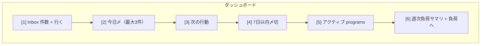

# ワイヤ（ラフ）

**位置づけ**  
[REQUIREMENTS.md](../REQUIREMENTS.md) [§7 画面一覧](../REQUIREMENTS.md#7-画面一覧mvp-中心) の**ブロック配置**のたたき。ピクセル正確でない。実装は **shadcn/ui 共通パーツ** [§5](../REQUIREMENTS.md#5-表示とデザインui) に従う。

**改訂**  

- 2026-04-24: 初版（Mermaid ブロック図 + 箇条書き）。

---

## 共通シェル

- 左または上: ナビ **Inbox | ダッシュボード | 負荷 | プログラム**、**設定**（末尾）  
- 全画面: テーマ切替は**設定**内またはヘッダー常設（[REQUIREMENTS.md](../REQUIREMENTS.md) §2.1）

---

## 1. ダッシュボード

---

## 2. Inbox

- 上: タイトル + **追加**（1 行入力＋即 POST）  
- 下: 未整理タスクの**リスト**（行タップ → タスク編集/移動）

---

## 3. プログラム一覧

- カード/行: 名前、期間、**開く**  
- **+ 新規プログラム**

## 4. プログラム詳細

- ヘッダ: 期間、編集  
- 配下: **プロジェクト**一覧、**+ プロジェクト**

## 5. プロジェクト詳細

- タスク表（行: タイトル、〆、状態）  
- フィルタ: 全て / 未完了（MVP 最小）

## 6. タスク編集

- タイトル、メモ、〆、**status**、**所属プロジェクト**（セレクト＝プログラム階層 or 直近）

## 7. 負荷ビュー（週次）

- 6 週分の**棒/バー** + 週展開のタスクリスト（折りたたみ）  
- 〆切なし件数（Should）は別枠

## 8. 設定

- Google アカウント表示、**ライト/ダーク**、ログアウト

---

**画像**を追加する場合は同フォルダに `export/` 等を切って配置してよい。

以上。